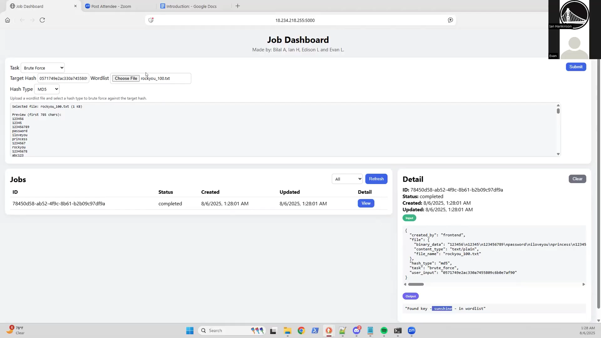

# Smart Job Executor with DynamoDB

Cloud-native job execution platform built with Python, Flask, Redis, Docker, and AWS services. The system supports asynchronous job processing, RESTful APIs, and scalable storage using DynamoDB, enabling efficient execution and tracking of submitted jobs.

---

## Overview

Smart Job Executor was developed to explore backend architecture, cloud computing, distributed systems, and asynchronous processing patterns.

The platform allows users to submit jobs through REST APIs while background workers process requests asynchronously using Redis queues. Job status and execution metadata are persisted using DynamoDB, enabling scalable storage and retrieval.

This project provided hands-on experience with service-oriented architecture, cloud deployment, containerization, and backend performance optimization.

---

## Key Features

- REST API for job submission and retrieval
- Asynchronous job processing using Redis queues
- Persistent job status tracking with DynamoDB
- Containerized development environment using Docker
- Modular backend architecture for maintainability and scalability
- Cloud-ready deployment workflow

---

## Technologies Used

### Languages
- Python
- JSON

### Frameworks & Libraries
- Flask
- Redis

### Cloud & Infrastructure
- AWS EC2
- DynamoDB
- Docker

### Concepts
- REST APIs
- Asynchronous Processing
- Distributed Systems
- Backend Architecture
- Cloud Computing

---

## System Architecture

```text
Client
  │
  ▼
Flask REST API
  │
  ▼
Redis Queue
  │
  ▼
Worker Process
  │
  ▼
DynamoDB
```

The API receives job requests and places them into a Redis queue. Background worker processes consume queued jobs asynchronously and update execution status within DynamoDB. This design reduces request blocking and improves overall system throughput.

---

## Engineering Contributions

- Refactored backend architecture, improving system modularity and reducing development/debugging time by approximately 30%
- Developed REST APIs for job submission and retrieval
- Implemented asynchronous job processing using Redis queues, reducing request blocking and improving processing throughput by approximately 40%
- Optimized job status retrieval and storage using DynamoDB, reducing data access latency by approximately 20–30%
- Deployed containerized services using Docker, reducing environment setup time and improving development consistency

---

## Challenges & Lessons Learned

One of the primary challenges was transitioning from synchronous request handling to an asynchronous architecture.

Initially, job execution occurred directly within API requests, causing requests to remain blocked while work completed. Introducing Redis queues and worker processes decoupled execution from the API layer, resulting in improved responsiveness and scalability.

This project reinforced concepts related to:

- Backend service design
- Queue-based architectures
- Cloud deployment workflows
- API development
- Distributed system fundamentals

---

## Screenshots

Screenshots coming soon.

```text
Recommended:
screenshots/
├── dashboard.png
├── api-testing.png
├── architecture.png
```

---

## Demo Video

[](https://drive.google.com/file/d/1LyVjNPSAutaYL8mawN9G5w5KU4qyqox3/view?usp=sharing)

---

## Future Improvements

- User authentication and authorization
- Job scheduling and recurring execution
- Monitoring dashboard with analytics
- Kubernetes deployment
- Automated CI/CD pipeline
- Enhanced logging and observability

---

## Installation

### Clone Repository

```bash
git clone https://github.com/bilalakhlaque/final_project_cc.git
cd final_project_cc
```

### Start Services

```bash
docker-compose up --build
```

### Access Application

```text
http://localhost:5000
```

---

## Author

Bilal Akhlaque, Ian Michael Hankinson, Edison Luong La, Evan J Langham

- GitHub: https://github.com/bilalakhlaque
- LinkedIn: https://linkedin.com/in/bilalaakhlaque
